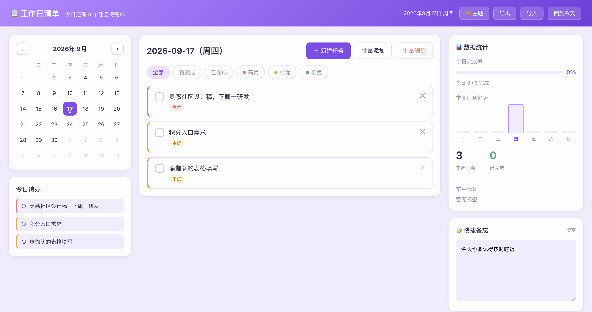
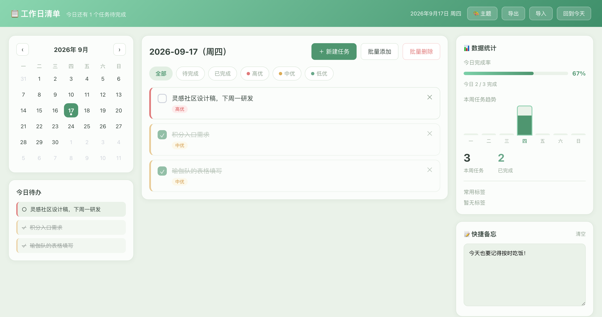
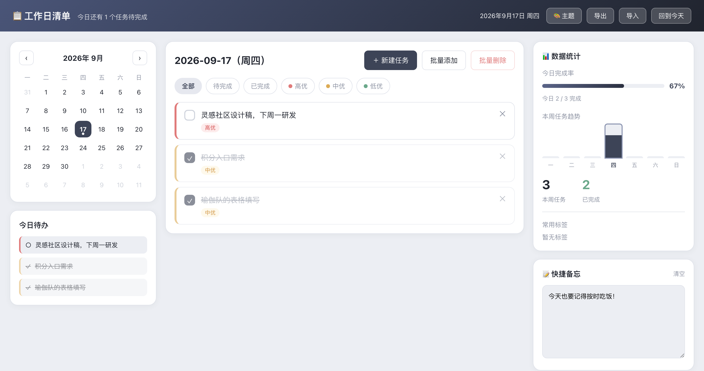

# 📋 工作日清单 · 每日待办

> 一个清爽、纯前端的每日待办 / 工作日程小工具。单个 HTML 文件即可运行，数据保存在浏览器本地，无需后端、无需安装。

**在线体验 👉 https://judy-1003.github.io/daily-todo/**



## ✨ 功能特性

- **日历视图**：月历切换，当天高亮，有未完成任务的日期带标记，点击任意日期管理当天待办
- **待办管理**：新建 / 批量添加 / 批量删除，支持
  - ⏰ 截止时间（DDL），当天过期自动标红
  - 🔴🟡🟢 优先级（高 / 中 / 低）
  - 🏷️ 标签
  - ✅ 打勾完成
- **数据统计**：今日完成率、本周任务趋势柱状图、常用标签 TOP
- **快捷备忘**：随手记录，自动保存
- **主题切换**：7 套单色渐变主题，选择自动记忆
- **数据导入 / 导出**：一键导出 JSON 备份，随时导入还原
- **每周自动备份**：距上次备份满 7 天且有数据时，自动导出一份 JSON，避免数据丢失

## 🎨 主题预览

| 护眼绿 | 极客黑 |
| --- | --- |
|  |  |

## 🗂️ 数据与存储

- 所有数据存放在**浏览器本地的 localStorage**，只属于你当前这台设备和浏览器，不上传、不共享。
- 换设备 / 换浏览器 / 清缓存后数据不会自动出现——请用**导出 JSON**做备份，在新环境用**导入**还原。
- 「每周自动备份」会在满 7 天时自动下载一份带 `周备份` 标记的 JSON 文件到本地。

## 🚀 使用方式

**在线**：直接打开 [在线 Demo](https://judy-1003.github.io/daily-todo/)。

**本地**：下载仓库后，用浏览器打开 `index.html` 即可，无需任何依赖。

```bash
git clone https://github.com/Judy-1003/daily-todo.git
cd daily-todo
open index.html   # macOS；Windows 双击 index.html
```

## 🛠️ 技术说明

- 纯 HTML + CSS + 原生 JavaScript，单文件、零依赖
- 通过 [GitHub Pages](https://pages.github.com/) 托管静态页面
- 主题为一组 CSS 变量，JS 动态注入到 `:root` 实现即时切换

## 📄 License

MIT
